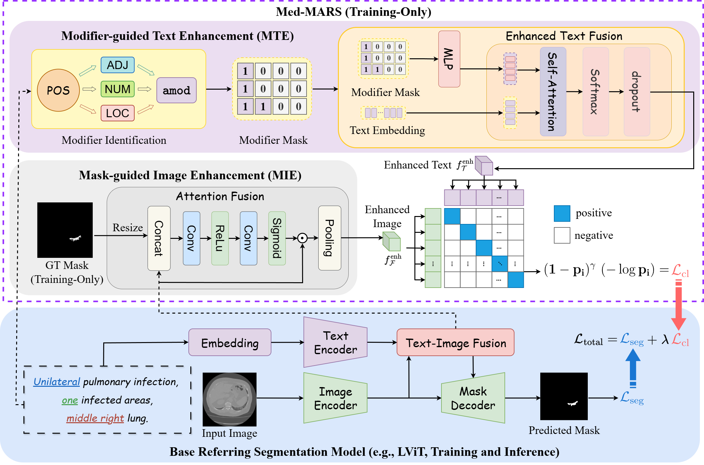
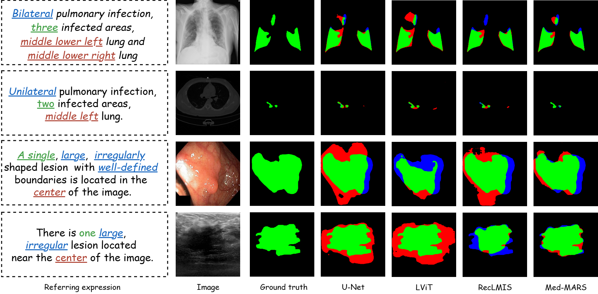

# MedMARS
# Med-MARS: Modifier-Aware Referring Segmentation for Medical Images

<p align="center">
  
</p>

<p align="center">
  Official PyTorch implementation of <b>Med-MARS</b><br>
  A training-time modifier-aware enhancement framework for medical referring image segmentation.
</p>

---

## Highlights

- 🔥 Modifier-aware medical referring segmentation framework
- 🔥 Explicit modeling of clinical modifiers (ADJ / NUM / LOC)
- 🔥 Plug-and-play design for existing RIS models
- 🔥 No additional inference-time overhead
- 🔥 State-of-the-art performance across four medical modalities
- 🔥 Expert-validated referring annotations for Kvasir-SEG and BUSI

---

# Overview

Medical referring image segmentation (MRIS) is particularly challenging due to low image contrast, anatomical ambiguity, and the heavy reliance on fine-grained clinical descriptions.

Unlike natural image referring segmentation, medical descriptions often depend on expressive modifiers such as:

- Adjectives (e.g., *unilateral*)
- Numerals (e.g., *one infected area*)
- Locative terms (e.g., *middle right lung*)

Med-MARS explicitly models these clinically meaningful modifiers to improve fine-grained cross-modal alignment.

Our framework consists of two lightweight training-time modules:

- **Modifier-guided Text Enhancement (MTE)**
- **Mask-guided Image Enhancement (MIE)**

Both modules are only used during training and introduce **no inference-time overhead**.

---

# Framework

<p align="center">
  
</p>

---

# Qualitative Results

<p align="center">
  
</p>

Med-MARS consistently produces more accurate and spatially precise segmentation results across:

- X-ray
- CT
- Endoscopy
- Ultrasound

---

# Installation

## Create Environment

```bash
conda create -n medmars python=3.10
conda activate medmars
